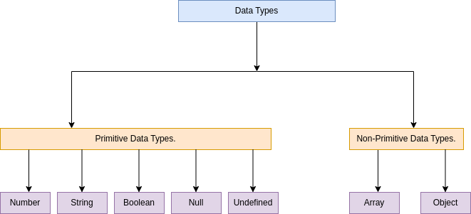

# JavaScript

## Introduction

The browser has an embedded engine sometimes called a `JavaScript virtual machine`.

Different engines have different “codenames”. For example:
- V8 – in Chrome, Opera and Edge.
- SpiderMonkey – in Firefox.
- …There are other codenames like  `Chakra` for IE, `JavaScriptCore`, `Nitro` and `SquirrelFish`s for Safari, etc.

## Variables

Variables are named values and can store any type of JavaScript value.

**Example**
```js
var x = 100;
```

And here’s what’s happening in the example above:

- var is the keyword that tells JavaScript you’re declaring a variable.
- x is the name of that variable.
- = is the operator that tells JavaScript a value is coming up next.
- 100 is the value for the variable to store.


### Using variables

After you declare a variable, you can reference it by name elsewhere in your code.

**Example**

```js
var x = 100;  
x + 102;

OUTPUT
202
```

  
You can even use a variable when declaring other variables.

**Example**

```js
var x = 100;  
var y = x + 102;  
y;

OUTPUT

202
```


### Reassigning variables


You can give an existing variable a new value at any point after it’s declared.

**Example**

```js
var weather = "rainy";  
​weather = "sunny";  
weather;

OUTPUT
"sunny"
```

### Naming variables

Variable names are pretty flexible as long as you follow a few rules:

*   Start them with a letter, underscore \_, or dollar sign $.
*   After the first letter, you can use numbers, as well as letters, underscores, or dollar signs.
*   Don’t use any of JavaScript’s reserved keywords.

With that in mind, here are valid variable names:

**Example**

```js
var camelCase = "lowercase word, then uppercase";  
var dinner2Go = "pizza";  
var I\_AM\_HUNGRY = true;  
var \_Hello\_ = "what a nice greeting"  
var $\_$ = "money eyes";  
```
  
And here are some invalid variable names — try to spot what’s wrong with each of them:

**Example**

```js
var total% = 78;  
var 2fast2catch = "bold claim";  
var function = false;  
var class = "easy";
```
  
Variable names are case-sensitive, so myVar, MyVar, and myvar are all different variables. But generally, it’s a good practice to avoid naming variables so similarly.

### Difference between `var`, `let`, and `const` keyword


#### Scope

| var | let | const |
|-----|-----|-------|
|Variables declared with `var` are in the function scope.|Variables declared as `let` are in the block scope.|Variables declared as `const` are in the block scope.|

```js

// var example
if(true){
 var a=10;
 console.log('a value with in the scope', a);

}

//let example
if(true){
 let b=11;
 console.log('b value with in the scope', b);
}

//const example
const c = 12;
//const c = 3 // if you declare will get an errror

 console.log('a value out of the scope', a);
 console.log('b value out of the scope', b); //will get error

```


#### Reassign the value

To reassign a value is to reassign the value of a variable.

| var | let | const |
|-----|-----|-------|
|Allowed|Allowed|Not allowed|

**Example**

- **var**
    ```js
    var v1 = 1;
    v1 = 30;
    console.log(v1);
    ```

- **let**
    ```js
    let v1 = 1;
    v1 = 30;
    console.log(v1);
    ```
- **const**
    ```js
    const v1 = 1;
    v1 = 30;
    console.log(v1);
    ```

Reassign difference between var, let, and const keyword

**Explanation:**

*   In the `var` and `let` tab, when you run the code, you will see that there is no error and we can define new values to the `var` and `let` variables.
    
*   In the `const` tab, when you run the code, you will get an error as a `const` variables value cannot be reassigned.
    

#### Redeclaration of the variable

The redeclaration of a variable means that you can declare the variable again.

| var | let | const |
|-----|-----|-------|
| Allowed | Not Allowed | Not allowed |

**Example**

- **var**
    ```js
    var v1 = 1;
    var v1 = 30;
    console.log(v1);
    ```

- **let**
    ```js
    let v1 = 1;
    let v1 = 30;
    console.log(v1);
    ```
- **const**
    ```js
    const v1 = 1;
    const v1 = 30;
    console.log(v1)
    ```


**Explanation:**

*   In the `var` tab, when you run the code, you will see that there is no error as we allowed to declare the same variable again.
    
*   In the `let` and the `const` tabs, when you run the code, you will get an error as the `let` and `const` variables do not allow you to redeclare them again.

## Data Types

Data types specify what kind of data can be stored and manipulated within a program. In JavaScript, data types are divided into two parts. Primitive data types and Non-Primitive data types. These data types are subdivided into several types.

Primitive data types are string, number, boolean, null, undefined, symbol. As you know, strings are used to express texts. numbers are used to denote numbers, booleans are used to denote “true” and “false”, nulls are used to denote that a variable “has no value”, undefined are used to denote indefinite variables, and symbols are used to denote symbols.

Non-Primitive data types were data types created within the object. These are arrays, objects, functions, dates, etc.



### Primitive Data Types:

 - #### String:
    Strings are written with quotes. You can use single or double quotes.

    ```js
    const str = 'some string';
    console.log(str);
    ```
 - #### Number:
    JavaScript has only one type of numbers. Numbers can be written with, or without decimals.

    ```js
    const nmbr = 20;
    console.log(nmbr);
    ```
 - #### Boolean:
    Booleans can only have two values: true or false.

    ```js
    const bln = true;
    console.log(bln);
    ```

    Booleans are often used in conditional testing.

    ```js
    const x = 15;
    const y = 15;
    console.log(x==y);
    ```

    ```js
    const x = 15;
    const y = 14;
    console.log(x==y);
    ```

 - #### Null:
    
    In JavaScript null is “nothing”. It is supposed to be something that doesn’t exist.

    ```js
    let nll = null;
    console.log(nll);
    ```

 - #### Undefined:
  
    In JavaScript, a variable without a value, has the value undefined. The type is also undefined.

    ```js
    let undf;
    console.log(undf);
    ```
### Non-Primitive Data Types:

 - #### Array: 

    JavaScript arrays are written with square brackets.Array items are separated by commas. Array indexes are zero-based, which means the first item is [0], second is [1], and so on.

    ```js
    let programmingLanguage = ["C", "C++", "R"];
    console.log(programmingLanguage);
    ```

    - #### Array Methods:

        - **push()**

            This method add the last element of an array, and returns the new length. It changes the original array.

            ```js
            const arr = [];
            arr.push(1);
            console.log(arr);
            ```
        - **pop()**

            This method remove the last element of an array, and returns the removed element. It changes the original array.

            ```js
            const arr = [];
            arr.pop();
            console.log(arr);
            ```
          > So new elements are added or taken always from the “end”.

        - **shift()**

          This method removes the first element of an array, and returns the new length. It changes the original array.

          ```js
          const fruits = ['Apple', 'Mango', 'Orange', 'Banana'];
          fruits.shift();
          console.log(fruits);
          ```

        - **unshift()**

          This method adds new items to the beginning of an array, and returns the new length. It changes the original array

          ```js
          const fruits = ['Apple', 'Mango', 'Orange', 'Banana'];
          fruits.unshift('Pineapple');
          console.log(fruits);
          ```
          > new elements are added or taken always from the "begining of the array".
        - **splice()**

          This method adds/remove items to/from an array, and returns the removed item(s)

          **Remove item from array**

          ```js
          const fruits = ['Apple', 'Mango', 'Orange', 'Banana'];
          fruits.splice(2, 1);
          console.log(fruits);
          ```

          **Add item from array**

          ```js
          const fruits = ['Apple', 'Mango', 'Orange', 'Banana'];
          fruits.splice(2, 0, "Lemon", "Kiwi");
          console.log(fruits);
          ```
        - **slice()**

          This method returns the selected elements in an array, as a new array object.

          This method selects the elements starting at the given start argument, and ends at, but does not include, the given end argument.

          ```js
          const fruits = ['Apple', 'Mango', 'Orange', 'Banana'];
          const newFruits = fruits.slice(1, 3);
          console.log(newFruits);
          ```
        - **sort()**

          This method sorts the items of an array. The sort order can be either alphabetic or numeric, and either ascending or descending.

          ```js
          const fruits = ['Apple', 'Mango', 'Orange', 'Banana'];
          fruits.sort();
          console.log(fruits);
          const numbers = [25, 10];
          numbers.sort();
          console.log(numbers);
          ```
        - **reverse()**

          The method reverses the order of elements in array.

          ```js
          let arr = [1, 2, 3, 4, 5];
          arr.reverse();
          alert( arr );
          ```
        - **concat()**

          This method is used to join two or more arrays. It does not change the existing arrays, but returns a new array, containing the values of the joined array.

          ```js
          const arr1 = [1,2,3];
          const arr2 = [4,5,6];
          const arr3 = arr1.concat(arr2);
          console.log(arr3);
          ```
        - **split()**

          It splits the string into an array by the given delimiter.

          ```js
          let names = 'ram, sam, raj';
          let arr = names.split(', ');
          console.log(arr);
          ```
        - **join()**
         
          This method does the reverse to split. It creates a string of arr items joined by between them

          ```js
          let arr = ['ram', 'sam', 'raj'];
          let str = arr.join(',');
          console.log( str );
          ```
